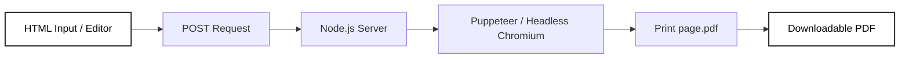
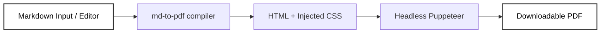
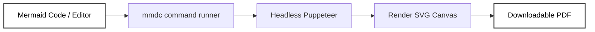
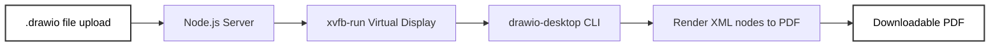
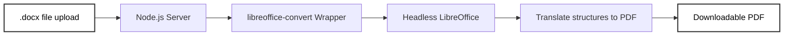

# PDFphile 

<p align="center">
  
</p>

**Live Demo**: [https://pdfphile.onrender.com/](https://pdfphile.onrender.com/)

PDFphile is a modern, developer-friendly web application designed to convert various document formats into beautifully styled PDFs. Moving beyond standard file conversions, PDFphile specializes in rendering uncommon design, markdown, and diagram formats, complete with a live-editor workspace and an intelligent AI PDF chatbot.

---

## 🚀 Key Features

### 1. 🔀 Uncommon & Complex File Conversions
Unlike typical converters that only support Word or TXT, PDFphile brings robust conversion engines for developer-centric formats:
*   **Draw.io (`.drawio`) to PDF**: Render multi-page vector graphics directly from Draw.io XML files.
*   **Mermaid (`.mmd` / `.mermaid`) to PDF**: Convert diagram-as-code text configurations (flowcharts, sequence diagrams, gantt charts) into crisp vector PDFs using the Mermaid CLI.
*   **Markdown (`.md`) to PDF**: Automatically parse and compile Markdown documents with complete code block syntax highlighting.
*   **HTML (`.html`) to PDF**: Compile complex markup structures into standard print-ready PDF formats.
*   **Word (`.docx`) to PDF**: High-fidelity rendering of Microsoft Word layouts powered by LibreOffice conversion engines.

### 2. ⚡ On-the-Fly Editing & Live Conversions
Skip the upload flow entirely using the built-in **Live Editor Workspace**. You can draft, preview, and build your documents in real time:
*   Write **Markdown**, **Mermaid** syntax, or **HTML** directly in the browser.
*   Convert your live-edited workspace into a PDF instantly with a single click.
*   **Fingertip Formatting Control**: In the HTML editor, you can inject **custom inline or block CSS** directly, granting you complete layout, padding, font, and color configuration authority over the final PDF output.

### 3. 🤖 AI Chatbot Assistant
Struggling to write correct Mermaid syntax or need to generate structured tables in Markdown? The integrated **AI Chatbot** helps you author documents effortlessly:
*   Prompt the chatbot to generate complex diagrams, resume layouts, or structured notes.
*   Get formatted HTML, Mermaid blocks, or Markdown syntax instantly.
*   Copy-paste directly into the Live Editor workspace for rapid compiling.

### 4. 🔒 Custom Authentication & Robust Backend Architecture
PDFphile is built with security and durability at its core:
*   **Custom JWT Authentication**: Dual-token authentication system using secure HTTP-only cookies (`accessToken` and `refreshToken`) for seamless user sessions.
*   **Structured API Standards**: Custom backend utility wrapper classes (`apiError`, `apiResponse`, and `asyncHandler`) ensuring standardized JSON responses and error logging across all routes.
*   **Automatic Temp Files Cleanup**: Secure server middleware hooks automatically delete uploaded files and generated assets immediately after transmission to keep host servers storage-optimized.

---

## 🛠 Tech Stack

### Frontend
*   **React.js** (Client application framework)
*   **TailwindCSS** (Modern custom design system)
*   **Axios** (Configured with credentials support for HTTP-only cookie validation)

### Backend
*   **Node.js & Express.js** (REST API architecture)
*   **MongoDB & Mongoose** (User information and conversion metadata)
*   **Puppeteer** (Headless Chromium engine optimized for low-memory PDF rendering)
*   **LibreOffice** (CLI backend for Word conversions)
*   **Mermaid-CLI** (Diagram generation compiler)
*   **Draw.io Desktop** (Headless vector exporter)

### Deployment
*   **Docker**: Fully containerized environment ensuring system-level binaries (Chromium, Xvfb, Draw.io, LibreOffice) run identically on local machines and cloud platforms.

---

## ⚙️ How Conversions Work (Behind the Scenes)

Here is a look at what is happening under the hood on the server during each conversion:

### 1. HTML to PDF
*   **Headless Browser rendering**: The backend spins up a headless instance of **Puppeteer (Chromium)**.
*   **Memory Optimization**: Optimized with flags (`--single-process`, `--disable-dev-shm-usage`, `--no-zygote`) to prevent Out Of Memory (OOM) crashes on low-resource environments (like Render's Free tier).
*   **Vector Export**: Puppeteer waits for external fonts/styles to load (`networkidle0`) and uses Chromium's native print engine (`page.pdf`) to write the final vector PDF layout.



### 2. Markdown to PDF
*   **HTML Compiler**: The backend compiles Markdown elements into clean HTML structure using `md-to-pdf`.
*   **Styling Injection**: Attach default styled Markdown CSS rules to render lists, blockquotes, tables, and highlighted code blocks correctly.
*   **Rendering**: The compiled HTML is passed into Puppeteer to output the PDF.



### 3. Mermaid Diagrams to PDF
*   **Text-to-Diagram**: The backend receives diagram code instructions and spawns the **Mermaid CLI (`mmdc`)** tool as a child process.
*   **Compilation**: `mmdc` runs Puppeteer under the hood, renders the charts on an SVG canvas, and compiles it into a high-quality PDF page.



### 4. Draw.io to PDF (Virtual Display Hack)
*   **Electron Client**: We install `drawio-desktop` (which is built on Electron and requires a screen display to launch) inside the Docker container.
*   **Virtual Framebuffer**: Because cloud servers are headless (no screen), we use **`xvfb-run -a` (X Virtual Framebuffer)**.
*   **Headless Rendering**: `xvfb-run` creates a virtual display buffer in memory. Draw.io launches inside this virtual screen, opens the XML design, exports a PDF, and shuts down instantly.



### 5. Word (`.docx`) to PDF
*   **Office Translation**: Reads the `.docx` binary buffer and routes it to `libreoffice-convert`.
*   **Headless Office**: Uses **LibreOffice (`soffice`)** running in `--headless` mode to parse the Microsoft Word formatting structure and output a PDF.



---

## 📦 Local Installation & Setup

### Prerequisites
Make sure you have [Docker](https://www.docker.com/) and [Node.js](https://nodejs.org/) installed.

### 1. Backend Setup
1. Navigate to the `Backend` directory:
   ```bash
   cd Backend
   ```
2. Create a `.env` file and define the following variables:
   ```env
   PORT=3000
   MONGO_URI=your_mongodb_connection_string
   ACCESS_TOKEN_SECRET=your_access_token_secret
   REFRESH_TOKEN_SECRET=your_refresh_token_secret
   A_T_EXPIRY=1d
   REFRESH_TOKEN_EXPIRY=10d
   GEMINI_KEY=your_gemini_api_key
   ORIGIN=http://localhost:5173
   ```
3. Build the Docker image locally:
   ```bash
   docker build -t pdfphile-backend .
   ```
4. Run the container:
   ```bash
   docker run --init --env-file .env -p 3000:3000 pdfphile-backend
   ```

### 2. Frontend Setup
1. Navigate to the `Frontend` directory:
   ```bash
   cd ../Frontend
   ```
2. Install dependencies:
   ```bash
   npm install
   ```
3. Run the development client:
   ```bash
   npm run dev
   ```
4. Access the web app at `http://localhost:5173`!
